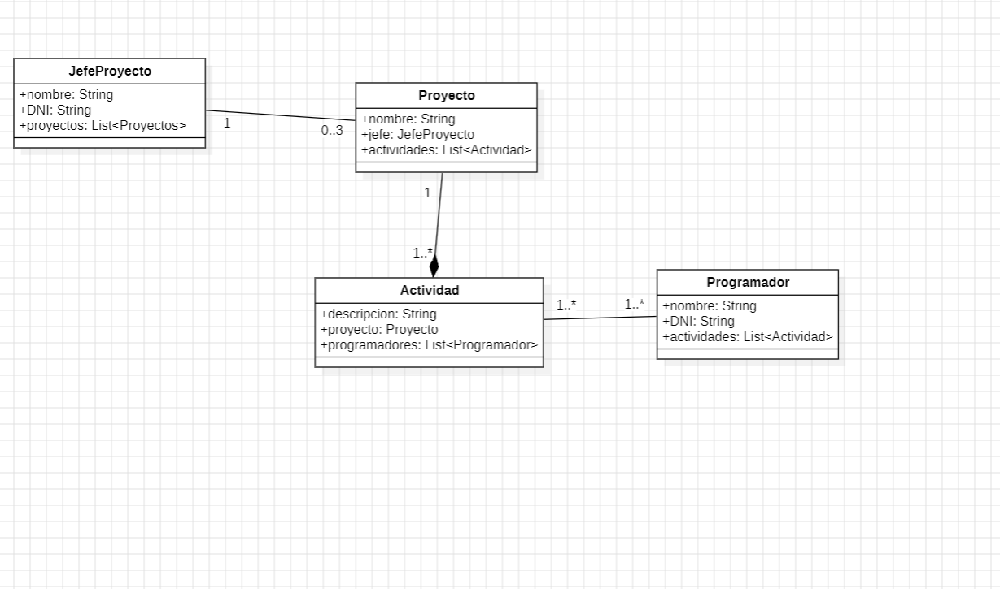

Ángel Leal Morales
Entornos de Desarrollo.

Diagrama de clases de gestión de proyectos
El objetivo de esta actividad es crear un diagrama de clases a partir de una toma de requerimientos.
Elabora el diagrama de clases que dé solución al siguiente enunciado:
Se desea desarrollar una aplicación informática que permita llevar a cabo la gestión de varios proyectos informáticos. Habrá que tener almacenada toda la información referente a cada proyecto que se quiera gestionar. Habrá dos tipos de personas que podrán estar involucradas en los proyectos, ya sea para su gestión o para la ejecución de sus actividades. Estos dos tipos de personas son el jefe de proyecto y el programador. De cada persona se desea almacenar su nombre y su DNI.
Un proyecto será liderado por un jefe de proyecto. Pero un jefe de proyecto sólo podrá gestionar tres proyectos. Un proyecto tiene actividades; cada proyecto podrá tener desde una a muchas (de forma indefinida) actividades, pero una actividad sólo podrá pertenecer a un proyecto.
Los programadores desarrollarán las actividades. Cada programador tendrá vinculada una actividad al menos, sin un máximo establecido. Igualmente, las actividades podrán ser desarrolladas por un mínimo de un programador, sin existir un máximo establecido.
Adjunto imagen del diagrama y modelo.
