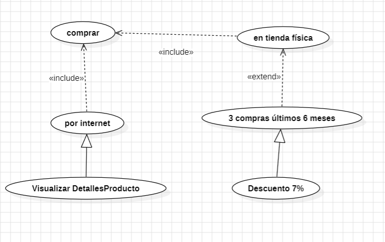

Ejercicio 3.
En un sistema de venta los clientes pueden realizar compras por internet, para lo cual es necesario ver los detalles del producto. El comercio también posee local físico donde los comerciales pueden realizar sus ventas. En cualquier caso es necesario tener actualizado el inventario antes de realizar cualquier tipo de venta. Para los clientes presenciales, deberemos conocer si han realizado al menos 3 compras en 6 meses en cuyo caso se les aplicará un descuento del 7%.

Adjunto modelo como model6.1.3.mdj

Ejercicio 4. 
Sistema de préstamos de biblioteca
El bibliotecario puede realizar préstamos y hacer recomendaciones. En ambos casos es necesario examinar el inventario de la biblioteca.
Para que el préstamo sea efectivo hay que identificar al usuario y comprobar los préstamos anteriores, en caso de que tuviera préstamos pendientes se le denegaría.
Del mismo modo si el prestatario va a devolver un libro y lo realiza con retraso se le efectuará un recargo.

Adjunto modelo como model6.1.4.mdj