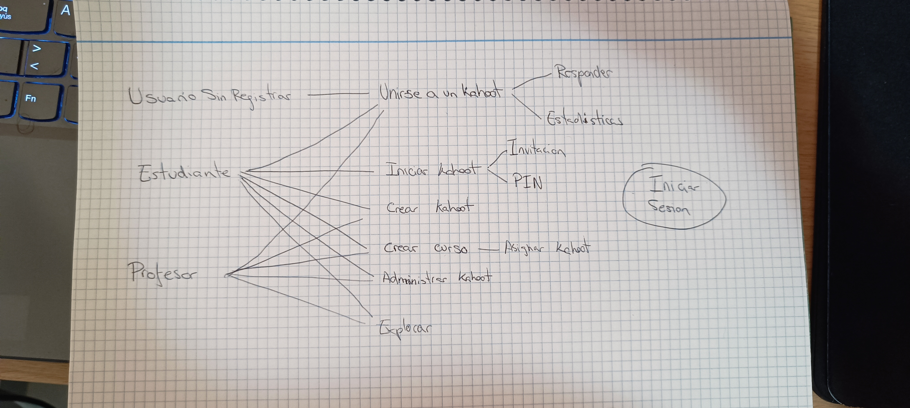
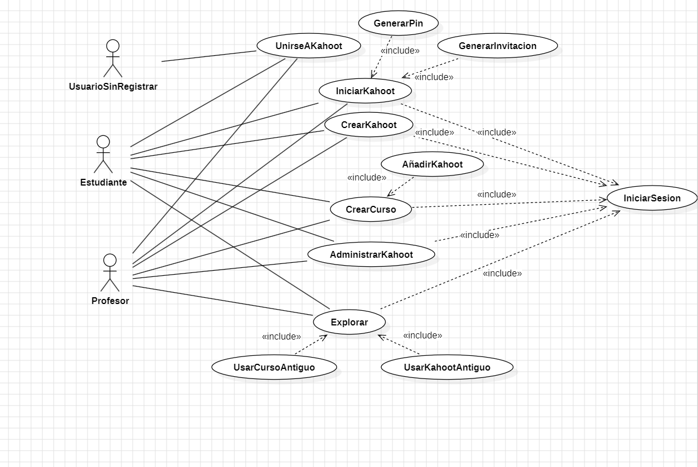

Hacer el diagrama de Casos de Uso de la aplicación Kahoot. Para los usuarios profesor, alumno y jugador sin registrar.
Para ello deberás registrarte y probar la aplicación lo suficiente para recopilar los casos de uso principales.
La tarea se recomienda realizarla en parejas.
Primero en libreta: anotaciones, diagramas y finalmente StarUml

